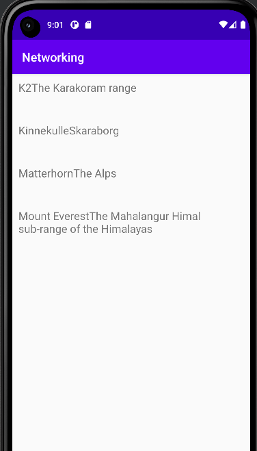

# Rapport - Networking
 

Uppgiftens huvudsakliga mål är att visa namnen på de olika bergen från en JSON URL, där de ska presenteras som en lista.
Med hjälp av kodsnutten nedan beskrivs det att JSON_URL har den angivna länken, vilket är där datan senare kommer att hämtas ifrån.
I onCreate används raden med kod för att ladda ned datan som innehåller information om bergen, i kombination med kod inom
JsonTask.java. Koden har exkluderats men kan kortfattat beskrivas som att hämtning av data sker i bakgrunden med hjälp av AsyncTask. 

    public class MainActivity extends AppCompatActivity implements JsonTask.JsonTaskListener {
    
        private final String JSON_URL = "https://mobprog.webug.se/json-api?login=brom";
       ...
     ...

        @Override
        protected void onCreate(Bundle savedInstanceState) {
          ...
            new JsonTask(this).execute(JSON_URL);
    
        }

Nedanstående block innehåller raden Gson gson = new Gson(); , vilket agerar som en omvandlare när det gäller java objekt och JSON data.
För att kunna använda någon typ av konvertering är denna inkluderad. Kodsnutten säger att från den JSON data som har hämtats, kan den omvandlas
till objekt vilket i detta fall är Mountain objekt. Dessa sätts i List som sedan sätts i variabeln listOfMountains.

    @Override
    public void onPostExecute(String json) {
    ...
    
            Gson gson = new Gson();
    
            Type type = new TypeToken<List<Mountain>>() {}.getType();
            List<Mountain> listOfMountains = gson.fromJson(json, type);

Ännu ett steg som har tagits är att implementera en recyclerview. Med denna kan datan presenteras i form av en lista. Nedanstånde kod är tagen ur
activity_main.xml och representerar den recyclerview som är tillagd där namnen sedan ska kunna visas. 

    <?xml version="1.0" encoding="utf-8"?>
    <androidx.constraintlayout.widget.ConstraintLayout xmlns:android="http://schemas.android.com/apk/res/android"
    ...
        <androidx.recyclerview.widget.RecyclerView
            android:id="@+id/recycler_view"
            android:layout_width="match_parent"
            android:layout_height="match_parent"
            app:layout_constraintBottom_toBottomOf="parent"
            app:layout_constraintLeft_toLeftOf="parent"
            app:layout_constraintRight_toRightOf="parent"
            app:layout_constraintTop_toTopOf="parent" />
    
    </androidx.constraintlayout.widget.ConstraintLayout>

Därefter skapades en RecyclerViewAdapter som kan koppla datan till en recyclerview. I denna klass kan koden som bidrar till viktiga funktioner
gås igenom stegvis. Med hjälp av denna kodsnutt kan en viss layout presenteras för varje item. Här förklaras det även att Mountain objekten sparas i en ArrayList. 

    RecyclerViewAdapter(Context context) {
        this.layoutInflater = LayoutInflater.from(context);
        this.items = new ArrayList<>();

    }

ViewHolder kan beskrivas som en container för de olika views som finns. Nedanstående kod hanterar skapandet 
av en ViewHolder där dennes innehållande item även får en layout kopplad till recyclerview_item filen. 

    @Override
    @NonNull
    public ViewHolder onCreateViewHolder(@NonNull ViewGroup parent, int viewType) {
        return new ViewHolder(layoutInflater.inflate(R.layout.recyclerview_item, parent, false));
    }

Följande kod är viktig för projektet då denna kopplar datan från ArrayList till RecyclerView där
den sedan kan presenteras i de olika views som finns. Här bestäms bergets namn respektive position i samband med den TextView 
som kan hittas i recyclerview_item. Namnen på bergen från ArrayList kopplas alltså
till Recyclerview som bidrar till skapandet av en visuell lista av dessa. Klassen ViewHolder innefattar 
den kod som specificerar vilken TextView (title) och dess id som ska användas, vilket förekommer i den första delen av
kodsnutten ovanför ellipsis. 

    @Override
    public void onBindViewHolder(ViewHolder holder, int position) {
    holder.title.setText(items.get(position).getName()+items.get(position).getLocation());
    }

    ...
    public class ViewHolder extends RecyclerView.ViewHolder {
    TextView title;

        ViewHolder(View itemView) {
            super(itemView);

            title = itemView.findViewById(R.id.title);
        }

    }
    ...

Med hjälp av klassen nedan skapas en varaibel (title), som senare används för att hämta en string som representeras av title. 
Denna kodsnutt illustrerar en item som kan hämtas och sedan presenteras i RecyclerView. 

    @SuppressWarnings("WeakerAccess")
    public class RecyclerViewItem {
    
        private String title;
    
        public RecyclerViewItem(String title) {
            this.title = title;
        }
    
        public String getTitle() {
            return title;
        }
    }

För att sammanfatta det som har beskrivits ovan hanterar detta hur datan parsas och presenteras när de kombineras med varandra. 
Först hämtas datan som konverteras från JSON till objekt, som med hjälp av recyclerviewadapter kopplar datan till respektive views som finns. 
Ett bildexempel som visar på den hämtade datan listad på appens sida finns nedan. 

](android.png)

